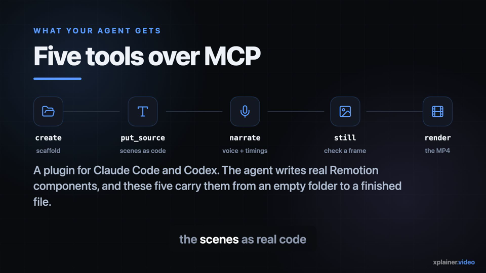
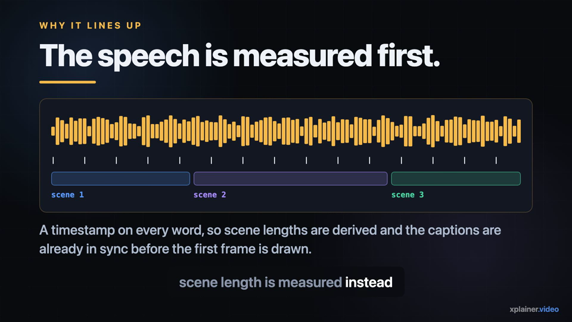
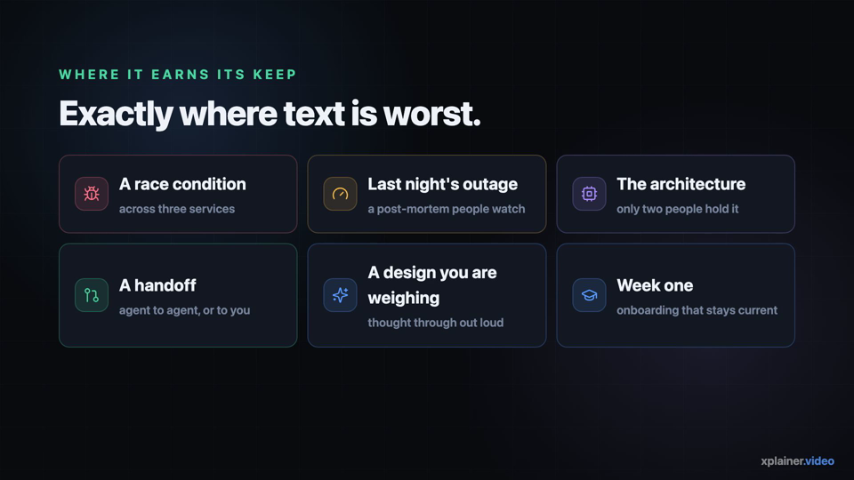
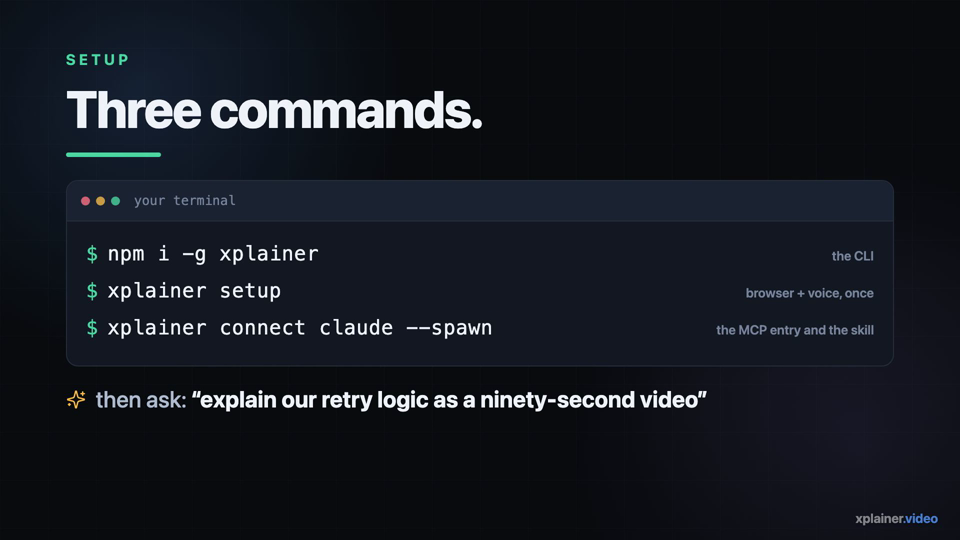

<h1 align="center">xplainer.video</h1>

<p align="center">
  <b>Your agents found the answer. Now see the explanation.</b>
  <br>
  <span>Narrated explainer videos, written by your coding agent, rendered on your own machine.</span>
</p>

<p align="center">
  <a href="https://www.npmjs.com/package/xplainer"></a>
  <a href="https://www.npmjs.com/package/xplainer"></a>
  <a href="https://github.com/BrewMyTech/xplainer.video/actions/workflows/ci.yml"></a>
  <a href="#-licence"></a>
  
  
  <a href="https://github.com/BrewMyTech/xplainer.video/stargazers"></a>
</p>

<p align="center">
  <a href="#-quick-start"><b>Quick start</b></a> ·
  <a href="#-your-first-video">First video</a> ·
  <a href="#-custom-pronunciations">Pronunciations</a> ·
  <a href="#-faq">FAQ</a> ·
  <a href="docs/ARCHITECTURE.md">Architecture</a> ·
  <a href="docs/ROADMAP.md">Roadmap</a>
</p>

https://github.com/user-attachments/assets/32e7abb8-eb8d-4359-a661-af709731788f

<p align="center">
  <sub>Ninety seconds, and it explains itself: an agent wrote the scenes, the built-in voice narrated them, and the machine it played on rendered it.<br>
  <code>docs/media/</code> holds the MP4, and <code>docs/media/xplainer-intro/</code> the <code>narrate</code> and <code>put_source</code> payloads that regenerate it.</sub>
</p>

<table>
  <tr>
    <td align="center" width="50%"></td>
    <td align="center" width="50%"></td>
  </tr>
  <tr>
    <td align="center" width="50%"></td>
    <td align="center" width="50%"></td>
  </tr>
</table>

<p align="center"><sub>Four frames from the video above — all of it drawn by the same five tools your agent gets.</sub></p>

## What this is

Working across several agents means repeatedly catching up on what each one found. xplainer turns
complex code, debugging findings and design ideas into narrated explainer videos, so you can follow
a problem without reconstructing it from a chat thread.

It is a plugin for **Claude Code**, **Codex** and **GitHub Copilot CLI**. Your agent writes the
scenes and the narration; xplainer produces a 1920×1080 MP4 with burnt-in captions. Speech and
rendering run on your machine.

> [!NOTE]
> **Nothing is uploaded.** `setup` downloads a headless browser, a speech model and a voice, each
> pinned by digest. After that, your source, your narration and your video stay on your disk.

## 📋 Contents

- [✨ Features](#-features)
- [🚀 Quick start](#-quick-start)
- [📖 Your first video](#-your-first-video)
- [🔊 Setup and speech](#-setup-and-speech)
- [🗣 Custom pronunciations](#-custom-pronunciations)
- [🔁 Updating](#-updating)
- [⚙ The optional daemon](#-the-optional-daemon)
- [🧩 Other install options](#-other-install-options)
- [🧠 How it works](#-how-it-works)
- [❓ FAQ](#-faq)
- [🧰 Tech stack](#-tech-stack)
- [🤝 Contributing and design](#-contributing-and-design)
- [📄 Licence](#-licence)

## ✨ Features

| Feature | What it means |
| --- | --- |
| 🎬 **Agent-driven** | Five MCP tools carry a video from an empty folder to a finished MP4 — eight in total |
| 🗣 **Built-in voice** | Kokoro ONNX runs in-process. No Docker, no Python, no speech server |
| ⏳ **Measured, never guessed** | Speech is generated first, so scene lengths come from the narration's own word timings |
| 💬 **Captions already in sync** | Burnt in, aligned before the first frame is drawn, and broken on sentences |
| 🔒 **Local by default** | Speech and rendering happen on your machine; nothing is uploaded |
| 🧩 **Three agents** | Claude Code, Codex and GitHub Copilot CLI, each one command |
| 🖥 **Cross-platform** | macOS, Linux and Windows — including headless servers |
| 🔁 **Optional daemon** | Renders outlive the agent session, and several agents share one queue |
| 📖 **Editable pronunciations** | Your own lexicon, consulted before the built-in one and before CMUdict |
| ⚖ **Apache-2.0** | Every one of the seven packages published to npm |

## 🚀 Quick start

Requires **Node 24 LTS**. Works on macOS, Linux and Windows.

### Option 1: npm (recommended)

```bash
npm i -g xplainer
xplainer setup
xplainer connect claude --spawn
```

For another agent, replace the last command:

| Agent | Command |
| --- | --- |
| Claude Code | `xplainer connect claude --spawn` |
| Codex | `xplainer connect codex --spawn` |
| GitHub Copilot CLI | `xplainer connect copilot --spawn` |

`connect` installs both the eight MCP tools and the skill that tells your agent how to use them.
`--spawn` starts the tools inside each agent session, so nothing needs to be running beforehand.
Keep the session open until the render finishes, or install the [daemon](#-the-optional-daemon).

### Option 2: no global install

```bash
npx -y xplainer setup
npx -y xplainer connect claude --spawn
```

The agent entry runs `npx -y xplainer mcp`, which caches the CLI under `~/.npm/_npx`.

### Option 3: Claude Code marketplace

```text
/plugin marketplace add BrewMyTech/xplainer.video
/plugin install xplainer
npx -y xplainer setup
```

> [!WARNING]
> This route installs the MCP tools but **not** the skill that guides the agent. Use Option 1 or 2
> for both. The missing skill is tracked in [the roadmap](docs/ROADMAP.md).

> [!IMPORTANT]
> `setup` is required for every route, and must run on the machine that will render. Allow roughly
> two minutes for the first downloads. **Intel Macs need an alternative speech route** — see
> [Setup and speech](#-setup-and-speech). Rendering uses Remotion under
> [its own licence terms](#-licence).

## 📖 Your first video

Run `/reload-plugins` in Claude Code, then ask for one in plain language:

> Explain how our retry logic works as a ninety-second video.

What happens next:

| Step | What your agent does |
| --- | --- |
| 1 | Scaffolds a video and writes the scenes as real Remotion components |
| 2 | Narrates them, and gets a timestamp back for every word |
| 3 | Renders one frame as a PNG and checks it before committing to a full render |
| 4 | Starts the render, gets a `job_id`, and polls until it finishes |
| 5 | Hands you the file path |

The MP4 lands at `<state dir>/workspace/out/<slug>/explainer.mp4`. Run `xplainer status` to print
the state directory.

## 🔊 Setup and speech

`xplainer setup` downloads a headless browser, prepares the Remotion workspace and installs the
built-in Kokoro ONNX speech engine: the model, one voice and your platform's ONNX Runtime. The
speech downloads come from their upstream sources and are pinned by digest; the browser and
workspace setup use the published
[toolchain manifest](https://cdn.xplainer.video/toolchain/v1/manifest.json).

The voice produces word-level timestamps, which is what lets scene lengths follow the narration
automatically. Render tools refuse to run until setup is complete — installing an agent plugin
alone does not prepare the machine.

**Intel Macs are the exception:** ONNX Runtime has no `darwin/x64` binding. Use a Kokoro-FastAPI
server you already run:

```bash
xplainer setup --tts-url <url>
```

Or use the pinned Docker speech image:

```bash
xplainer setup --speech docker
```

Both alternatives work on every supported machine, not just Intel Macs. Setup preserves a recorded
Docker route; `xplainer setup --speech onnx` switches back to the built-in engine where it is
available.

For a local Kokoro-FastAPI server from this checkout:

```bash
docker compose -f infra/docker-compose.tts.yml up --build
xplainer setup --tts-url http://localhost:8880
```

At an interactive terminal, setup also asks once whether to star the repository on GitHub. Enter
declines, the prompt expires after ten seconds, and `--no-star` skips it. It never asks in CI,
during `xplainer update`, or if you have already starred the repository.

## 🗣 Custom pronunciations

Available from **0.0.8**, for the built-in speech engine. When narration has to guess a word it
prints `speech derived a pronunciation for X`. If the result sounds wrong, add your own to
`<state dir>/lexicon.txt`. You can also override a shipped pronunciation, including words that
produced no warning.

`xplainer status` prints the state directory. On macOS the file is:

```text
~/Library/Application Support/video.xplainer/lexicon.txt
```

`xplainer setup` creates it with commented examples and an IPA key. One entry per line, spaces
between the columns, and an optional gloss after `#`:

```text
<spelling><spaces><IPA><spaces># optional gloss
```

For example:

```text
kubectl        kjˈubkˌʌtəl               # koob-CUT-ul
```

The second column is **Kokoro's IPA, not English spelling**. A rough key:

| Symbol | Sound |
| --- | --- |
| `A` | "ay" |
| `I` | "eye" |
| `i` | "ee" |
| `O` | "oh" |
| `ɛ` | "eh" |
| `ˈ` | Marks stress |

The warning includes the guessed IPA as a starting point: copy it into the file and adjust what
sounds wrong, or adapt one of the examples. Remove the leading `#` to activate a commented example.

Your file is consulted **before the built-in lexicon and before CMUdict**. Matching depends on how
you spell the entry:

- A lower-case spelling matches any case — `api` catches `API`.
- A spelling containing a capital matches exactly — `ID` leaves the word `id` alone.

Malformed lines are reported and skipped; they never fail a narration. The file survives upgrades,
and running setup again preserves your edits.

## 🔁 Updating

```bash
xplainer update
```

This re-runs setup, brings an installed daemon onto this version, and refreshes every configured
agent's MCP entry and skill, preserving whether each one uses `--spawn` or attaches to a daemon.

> [!IMPORTANT]
> **Run this after every `npm i -g`, not instead of it.** Upgrading through a package manager
> replaces the CLI and leaves the daemon's pinned runtime exactly where it was — and the daemon is
> what renders. `xplainer status` warns when the two are out of step; `xplainer update` is what
> brings them level. On a machine with no daemon the step does nothing.

If you upgrade through npm instead, re-run `connect` for each agent you use:

```bash
npm i -g xplainer@latest
xplainer connect claude --spawn
```

Use `codex` or `copilot` as appropriate, and omit `--spawn` if you use the daemon. Each run reports
whether the entry and skill were written or were already current.

Skills live at `~/.claude/skills/xplainer/SKILL.md`, `~/.codex/skills/xplainer/SKILL.md` or
`~/.copilot/skills/xplainer/SKILL.md`. Copilot uses `COPILOT_HOME` instead of `~/.copilot` when set.

## ⚙ The optional daemon

Install the daemon if you want renders to continue after you close your agent, or if several agents
should share one render queue and speech engine. After the quick start above:

```bash
xplainer daemon install
xplainer connect claude
xplainer daemon status
```

Use `codex` or `copilot` in the second command for those agents. Without `--spawn`, `connect`
attaches the agent to the daemon; if no daemon has ever bound, it exits with code `3` and writes
nothing. Both modes provide the same eight tools.

| | Per-session tools (`--spawn`) | Daemon |
| --- | --- | --- |
| Starts | With each agent session | As a per-user service |
| Agent closes or reconnects | Unfinished renders stop; their job IDs no longer resolve | Renders and job records outlive the agent session |
| Several agents | Separate queues; a per-video lock prevents conflicting jobs | One shared serial queue and render/speech machinery |
| Finished files | Stay on disk | Stay on disk |
| Cost | ~140 ms to start, ~98 MB while idle | One resident process |

The daemon registers with launchd on macOS, `systemd --user` on Linux or Task Scheduler on Windows,
without an administrator. From an npm install it builds a relocatable payload of roughly 150 MB,
including its own interpreter, so changing your Node installation does not break the service.

For a checkout, CI or an install using an explicitly supplied runtime:

```bash
xplainer runtime build --out <dir>
xplainer daemon install --runtime <dir>
```

Daemon updates are staged and journalled, with rollback if the replacement fails to become ready.
See the [daemon guide](docs/daemon.md) for lifecycle commands, logs, updates, remote access and
running on hosts without a user service manager.

## 🧩 Other install options

**Desktop:** an optional Electron client can start the bundled CLI or attach to a daemon elsewhere.
Installers are currently unsigned, and macOS installers support **arm64 only**. The
[roadmap](docs/ROADMAP.md) tracks signing and platform support.

## 🧠 How it works

The agent writes [Remotion](https://remotion.dev) scenes and a narration spec, then drives:

```text
create → put_source → narrate → still → render
```

Narration determines scene lengths from word timings. The still is a PNG preview; the final render
is a 1920×1080 MP4 with burnt-in captions. The engine owns the composition shell (`Video.tsx`),
which the agent cannot overwrite, so scene edits preserve the audio and the captions. Renders are
asynchronous: the agent gets a `job_id` and polls for progress.

The eight tools are:

| Tool | Purpose |
| --- | --- |
| `explainer_create` | Scaffold a video |
| `explainer_put_source` | Write scene source |
| `explainer_put_media` | Add media assets |
| `explainer_narrate` | Generate narration and timings |
| `explainer_still` | Render a preview frame |
| `explainer_render` | Render the final video |
| `explainer_job` | Check job status and recent output |
| `explainer_list` | List explainers |

The CLI owns the runtime and works on headless Linux machines as well as desktops. The Electron
client contains no rendering or speech implementation. Agents use stdio MCP; daemon connections
proxy it over a local socket or Windows named pipe, with no URL, port or token in the agent
configuration.

For direct use, `xplainer serve` exposes `/healthz`, `/mcp` and the desktop's `/api/*` surface. The
HTTP endpoints require a bearer token; the daemon also validates `Host` and `Origin`, owns its state
directory and drains on `SIGTERM`. `xplainer status` reports its health in prose or JSON. The
[daemon guide](docs/daemon.md) covers authentication and operation.

## ❓ FAQ

### Does anything leave my machine?

No. `setup` downloads a headless browser, the speech model, a voice and your platform's ONNX
Runtime, each pinned by digest. Making a video after that uses none of them again: your source,
narration, stills and MP4 stay on your disk.

### Do I need Docker or Python?

Not for the default route. Docker is only involved if you deliberately choose
`xplainer setup --speech docker`, and Python only if you build from this checkout.

### How long does the first run take?

Roughly two minutes for the setup downloads. The first render is slower than later ones because the
browser and speech engine are cold; after that a ninety-second video takes a few minutes on a
laptop.

### Setup fails on my Intel Mac.

ONNX Runtime publishes no `darwin/x64` binding, so the built-in engine cannot run there. Use
`xplainer setup --tts-url <url>` against a Kokoro-FastAPI server, or `--speech docker`. See
[Setup and speech](#-setup-and-speech).

### A word is pronounced wrong.

Add it to `<state dir>/lexicon.txt`. See [Custom pronunciations](#-custom-pronunciations) — your
entries win over both the built-in lexicon and CMUdict.

### Can a render survive closing my agent?

With `--spawn`, no: the tools live inside the agent session, and an interrupted render does not
resume. With the [daemon](#-the-optional-daemon), yes. Completed MP4s, stills and narration timings
always remain in the workspace either way.

### Does it work on a headless server?

Yes. The CLI owns the runtime and renders on headless Linux; the Electron desktop client is
optional and contains no render or speech code of its own.

### Can several agents use it at once?

Yes. With `--spawn` each agent gets its own queue, and a per-video lock stops two of them
conflicting on the same video — jobs that collide get a retryable response. With the daemon they
share one serial queue and one speech engine.

### Is there a hosted version?

Not in this repository. The hosted tier lives in a separate private repository and is deferred
pending a Remotion licensing decision; the local product does not depend on it. See
[ADR 0023](docs/adr/0023-split-the-repository.md).

## 🧰 Tech stack

| Layer | What it uses |
| --- | --- |
| Rendering | [Remotion](https://remotion.dev) on a pinned headless Chrome |
| Speech | Kokoro-82M ONNX in-process, with word-level timestamps; Kokoro-FastAPI over HTTP or Docker as alternatives |
| Agent interface | MCP over stdio; the daemon proxies it over a local socket or Windows named pipe |
| CLI and daemon | Node 24, with launchd, `systemd --user` or Task Scheduler |
| Desktop (optional) | Electron — no render or speech implementation of its own |
| Contract | JSON Schema, code-generated into both TypeScript and Python |

## 🤝 Contributing and design

Start with [AGENTS.md](AGENTS.md) for bootstrap, package invariants and the canonical post-change
procedure. Contributors need [uv](https://docs.astral.sh/uv/) and Python 3.13 as well as Node 24;
use the versions pinned in the repository. The quick development check is
`pnpm turbo build lint typecheck test`, which covers both languages. Follow AGENTS.md for the full
verification procedure.

- [Architecture](docs/ARCHITECTURE.md): the ten workspace members, layout, dependency tiers,
  generated TypeScript/Python contract and development recipes.
- [Decision records](docs/adr/): the reasons behind the design, including alternatives rejected.
- [Roadmap](docs/ROADMAP.md): what works, what remains and the criteria for each phase.
- [Acceptance criteria](docs/acceptance-criteria.md): the numbered checks cited by code and CI.

Contributions to the Apache-2.0 packages use the licence's inbound grant; no separate CLA is
required. Open an issue before contributing to the proprietary parts of the repository.

## 📄 Licence

The **seven packages published to npm** are open source under the Apache Licence 2.0:

| Directory | Package |
| --- | --- |
| `apps/cli` | `@xplainer/cli` |
| `packages/alias` | `xplainer` |
| `packages/mcp-server` | `@xplainer/mcp-server` |
| `packages/protocol` | `@xplainer/protocol` |
| `packages/render-core` | `@xplainer/render-core` |
| `packages/skill` | `@xplainer/skill` |
| `packages/tts-client` | `@xplainer/tts-client` |

The unscoped `xplainer` package forwards to `@xplainer/cli`. See
[LICENSE-APACHE-2.0](LICENSE-APACHE-2.0) and [NOTICE](NOTICE); both accompany the published
packages, whose manifests declare `Apache-2.0`.

**The rest of this repository remains proprietary**, including `apps/desktop`, `packages/config`,
`services/tts-sidecar`, infrastructure, scripts, docs and root files. [LICENSE](LICENSE) defines the
boundary. The historical `open-later` tier label describes the plan, not a licence grant.

> [!IMPORTANT]
> **Remotion has its own terms.** It is free for individuals and companies of up to three people;
> larger companies need their own Remotion licence. xplainer's Apache-2.0 licence does not grant
> rights to Remotion. The render workspace installs Remotion as a dependency on your machine;
> xplainer does not bundle it. See [Remotion's licence](https://remotion.pro/license) and
> [NOTICE](NOTICE).
